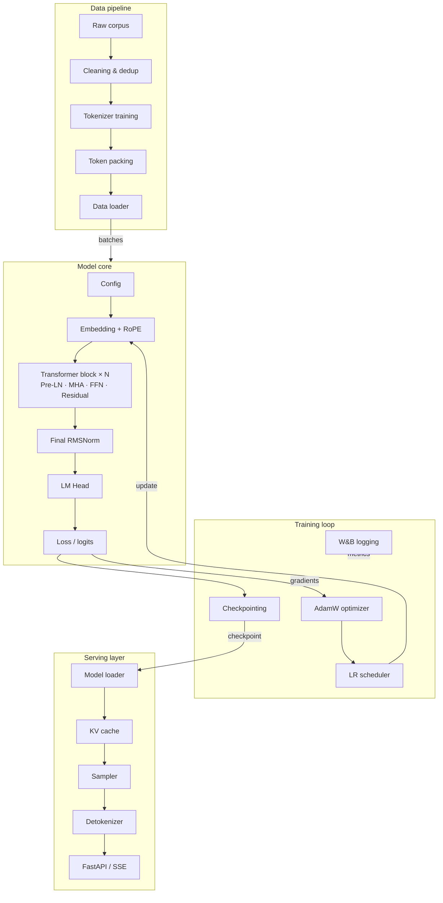
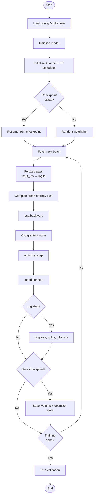
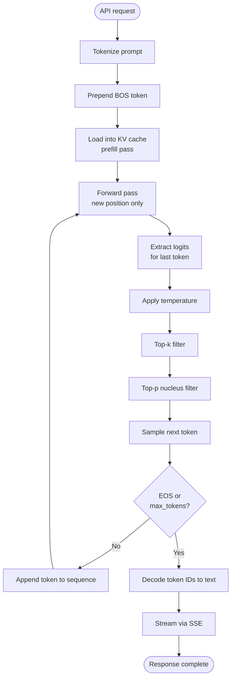

# LLM Build Plan — Full Specification

> A complete, phase-by-phase plan for building a large language model from scratch: data pipeline, model architecture, training loop, fine-tuning, and serving.

---

## Table of contents

1. [Project overview](#1-project-overview)
2. [Tech stack](#2-tech-stack)
3. [Phase 1 — Data pipeline](#3-phase-1--data-pipeline)
4. [Phase 2 — Tokenizer](#4-phase-2--tokenizer)
5. [Phase 3 — Model architecture](#5-phase-3--model-architecture)
6. [Phase 4 — Training loop](#6-phase-4--training-loop)
7. [Phase 5 — Fine-tuning & alignment](#7-phase-5--fine-tuning--alignment)
8. [Phase 6 — Inference & serving](#8-phase-6--inference--serving)
9. [Phase 7 — Evaluation](#9-phase-7--evaluation)
10. [Architecture diagram (Mermaid)](#10-architecture-diagram-mermaid)
11. [Training workflow (Mermaid)](#11-training-workflow-mermaid)
12. [Inference workflow (Mermaid)](#12-inference-workflow-mermaid)
13. [Functional requirements summary](#13-functional-requirements-summary)
14. [Hyperparameter reference](#14-hyperparameter-reference)
15. [Milestones & timeline](#15-milestones--timeline)

---

## 1. Project overview

The goal is to build a decoder-only transformer language model — the same family as GPT, LLaMA, and Mistral — capable of next-token prediction and downstream text generation tasks.

The build is divided into seven sequential phases. Each phase has its own functional requirements, acceptance criteria, and deliverables. The system is designed to be modular: you can swap the tokenizer, optimizer, or sampler without touching the rest of the codebase.

### Scope

| Item | Decision |
|---|---|
| Architecture | Decoder-only transformer |
| Scale (starter) | ~125M parameters |
| Training objective | Causal language modelling (CLM) |
| Fine-tuning | Supervised fine-tuning (SFT) + optional RLHF |
| Serving | REST API with streaming |

---

## 2. Tech stack

| Layer | Choice | Notes |
|---|---|---|
| Language | Python 3.11+ | Type hints throughout |
| Deep learning | PyTorch 2.x | `torch.compile` for speed |
| Tokenizer | `sentencepiece` or `tiktoken` | BPE algorithm |
| Data processing | `datasets` (HuggingFace) | Arrow-backed streaming |
| Training infra | PyTorch FSDP or DeepSpeed ZeRO | Multi-GPU sharding |
| Experiment tracking | Weights & Biases | Loss curves, gradients |
| Serving | FastAPI + `uvicorn` | SSE for streaming |
| Containerisation | Docker + CUDA base image | Reproducible builds |
| Hardware (minimum) | 1× A100 80 GB | Or 4× A6000 48 GB |

---

## 3. Phase 1 — Data pipeline

### Goal

Collect, clean, and tokenise a high-quality text corpus and expose it as a streaming data loader ready for training.

### Functional requirements

**FR-1.1 — Corpus ingestion**
- Ingest at minimum three source types: web crawl (CommonCrawl / C4), books (Project Gutenberg / Books3), and code (The Stack / GitHub).
- Support streaming download so the full dataset never has to live on disk at once.
- Record provenance metadata (source, language, date) for every document.

**FR-1.2 — Cleaning**
- Remove HTML tags, boilerplate footers/headers, and non-UTF-8 characters.
- Apply language identification and keep only target languages (e.g. English).
- Filter documents below a minimum quality threshold (perplexity filter or heuristic rule-set).

**FR-1.3 — Deduplication**
- Run exact deduplication using SHA-256 document hashes.
- Run near-deduplication using MinHash LSH with a Jaccard similarity threshold of 0.8.
- Deduplicate across splits (no training document must appear in validation).

**FR-1.4 — Dataset splits**
- Produce `train`, `validation`, and `test` splits at a 98 / 1 / 1 ratio.
- Validation and test sets must be held out before any cleaning decisions are made.

**FR-1.5 — Data loader**
- Emit batches of shape `[batch_size, seq_len]` as integer token ID tensors.
- Support infinite cycling with shuffling at the document level.
- Support multi-process workers (`num_workers ≥ 4`) and pre-fetching.
- Emit `input_ids` and `labels` (labels = input_ids shifted right by one position).

### Acceptance criteria

- Cleaned corpus contains ≥ 10B tokens for a 125M model (scale proportionally for larger models).
- Data loader throughput ≥ model's token/s consumption at peak GPU utilisation.
- Zero token overlap between train and validation sets (verified by hash check).

---

## 4. Phase 2 — Tokenizer

### Goal

Train a subword tokeniser on the corpus and expose encode/decode APIs.

### Functional requirements

**FR-2.1 — Algorithm**
- Use Byte-Pair Encoding (BPE) as the base algorithm.
- Byte-level BPE (as in GPT-2) is preferred — it handles any Unicode without `<unk>`.

**FR-2.2 — Vocabulary**
- Default vocabulary size: 32,000 tokens (adjust to 50,257 for GPT-2 compatibility or 128,000 for multilingual).
- Reserve indices for special tokens: `<pad>`, `<bos>`, `<eos>`, `<unk>`, and at least 64 user-defined slots.

**FR-2.3 — Training**
- Train the tokeniser exclusively on the training split of the corpus.
- Save the vocabulary file and merge rules in a format compatible with `sentencepiece` or `tiktoken`.

**FR-2.4 — APIs**
- `tokenizer.encode(text: str) -> list[int]` — optionally prepend `<bos>`.
- `tokenizer.decode(ids: list[int]) -> str` — strip special tokens by default.
- `tokenizer.vocab_size -> int`

**FR-2.5 — Fertility**
- Average fertility (tokens per word) must be ≤ 1.5 on English prose.

### Acceptance criteria

- Tokeniser round-trips any Unicode string losslessly.
- Vocabulary file is checked into version control alongside model config.

---

## 5. Phase 3 — Model architecture

### Goal

Implement a decoder-only transformer in PyTorch. Every component must be independently unit-testable.

### Functional requirements

**FR-3.1 — Embedding layer**
- Token embedding table of shape `[vocab_size, d_model]`.
- Positional encoding: Rotary Position Embedding (RoPE) — applied inside each attention head, not as a separate additive term.
- Input dropout applied after embedding (rate 0.0 at scale, 0.1 for small runs).

**FR-3.2 — Transformer block**

Each block contains, in order:

1. Pre-layer normalisation (RMSNorm preferred over LayerNorm — faster, no bias).
2. Multi-head causal self-attention (see FR-3.3).
3. Residual connection.
4. Pre-layer normalisation.
5. Position-wise feed-forward network (see FR-3.4).
6. Residual connection.

The block is repeated `n_layers` times.

**FR-3.3 — Multi-head causal self-attention**
- Project input to Q, K, V using linear layers (no bias).
- Split into `n_heads` heads of dimension `d_head = d_model // n_heads`.
- Apply RoPE to Q and K before computing attention scores.
- Compute scaled dot-product attention: `softmax(QKᵀ / √d_head) · V`.
- Apply a causal mask — each position can only attend to itself and earlier positions.
- Concatenate heads and apply output projection `W_o`.
- Support Grouped Query Attention (GQA) for efficient large-scale training.

**FR-3.4 — Feed-forward network (FFN)**
- Two-layer MLP with hidden dimension `d_ff = 4 × d_model`.
- Activation function: SwiGLU (gated linear unit with Swish gate) — state of the art for LLMs.
- No bias terms in FFN linear layers.

**FR-3.5 — LM head**
- Final RMSNorm applied to the last hidden state.
- Linear projection from `d_model` to `vocab_size`.
- Weight tying: the LM head weight matrix is shared with the token embedding table — reduces parameters and improves training stability.

**FR-3.6 — Causal mask**
- Register a lower-triangular boolean mask as a buffer (not a parameter) so it moves to the correct device automatically.
- Use `torch.nn.functional.scaled_dot_product_attention` with `is_causal=True` for Flash Attention compatibility.

**FR-3.7 — Model config**
- All hyperparameters live in a single `ModelConfig` dataclass — no magic numbers scattered in the code.
- Config is serialisable to JSON and saved alongside every checkpoint.

### Acceptance criteria

- Forward pass produces output of shape `[batch, seq_len, vocab_size]`.
- Causal mask verified: token at position `i` cannot attend to position `j > i` (unit test).
- Parameter count matches expected value within 1% for a given config.

---

## 6. Phase 4 — Training loop

### Goal

Implement a stable, resumable pretraining loop that saturates GPU utilisation.

### Functional requirements

**FR-4.1 — Forward pass**
- Pass `input_ids` through the model to obtain logits.
- Compute cross-entropy loss between `logits[:, :-1, :]` and `labels[:, 1:]` (next-token prediction).
- Ignore padding positions in the loss via a mask.

**FR-4.2 — Backward pass**
- Call `loss.backward()` to compute gradients.
- Clip gradient norm to `max_grad_norm = 1.0` before the optimizer step.

**FR-4.3 — Optimizer**
- Use AdamW with `β₁=0.9`, `β₂=0.95`, `ε=1e-8`, `weight_decay=0.1`.
- Do not apply weight decay to bias terms, embeddings, or LayerNorm/RMSNorm parameters.

**FR-4.4 — Learning rate schedule**
- Warmup: linear ramp from 0 to `lr_max` over `warmup_steps` (typically 2,000 steps).
- Decay: cosine annealing from `lr_max` down to `lr_min = lr_max / 10` over the full training budget.

**FR-4.5 — Mixed precision**
- Train in `bfloat16` (A100/H100) or `float16` with dynamic loss scaling (older GPUs).
- Keep the master weights and optimizer state in `float32`.

**FR-4.6 — Distributed training**
- Use PyTorch FSDP (Fully Sharded Data Parallelism) for multi-GPU runs.
- Support tensor parallelism via `torch.distributed` for very large models.
- Data parallelism batch size must remain consistent across GPU counts (scale by world size).

**FR-4.7 — Checkpointing**
- Save a checkpoint every N steps containing: model weights, optimizer state, scheduler state, step number, RNG state.
- Support resuming training from any checkpoint without loss spike.
- Keep the last K checkpoints and always keep the best checkpoint by validation loss.

**FR-4.8 — Logging**
- Log to Weights & Biases every M steps: loss, perplexity, learning rate, gradient norm, tokens/sec, GPU memory.
- Log a sample generation every N steps to track qualitative progress.

### Acceptance criteria

- GPU utilisation ≥ 85% throughout training.
- Training loss decreases smoothly — no NaN or explosion in the first 10,000 steps.
- Resuming from a checkpoint produces identical loss trajectory as uninterrupted training.

---

## 7. Phase 5 — Fine-tuning & alignment

### Goal

Adapt the pretrained base model for instruction-following and alignment.

### Functional requirements

**FR-5.1 — Supervised fine-tuning (SFT)**
- Format data as `<bos> [INST] {instruction} [/INST] {response} <eos>`.
- Compute loss only on the response tokens (mask out the instruction prefix).
- Use a lower learning rate than pretraining (`lr = 2e-5`) and train for 1–3 epochs.

**FR-5.2 — Preference data (optional RLHF)**
- Collect or use an existing dataset of preference pairs (chosen response vs rejected response).
- Train a reward model on top of the SFT model using a Bradley-Terry ranking loss.

**FR-5.3 — RLHF / DPO (optional)**
- Option A — PPO: use the reward model to provide a reward signal and fine-tune via Proximal Policy Optimisation.
- Option B — DPO (simpler): skip the reward model and optimise directly on preference pairs using Direct Preference Optimisation loss.
- DPO is recommended for teams without large-scale RL infrastructure.

**FR-5.4 — Safety filtering**
- Apply a classifier to filter harmful outputs from the fine-tuning dataset.
- Implement a system-prompt mechanism to steer model behaviour at inference time.

### Acceptance criteria

- SFT model follows instructions reliably on a held-out instruction set.
- Alignment-tuned model scores higher than the base model on a preference evaluation set.

---

## 8. Phase 6 — Inference & serving

### Goal

Serve the model over an API with low latency and high throughput.

### Functional requirements

**FR-6.1 — Model loading**
- Load checkpoint weights into the model architecture in `float16` or `bfloat16`.
- Support loading sharded checkpoints for large models.
- Move model to GPU and call `model.eval()` + `torch.inference_mode()`.

**FR-6.2 — KV cache**
- Cache the key and value tensors from all past positions in each attention layer.
- On each new token, only compute attention for the single new position, not the full sequence.
- Pre-allocate the KV cache as a fixed-size tensor to avoid runtime memory allocation.

**FR-6.3 — Sampling**
- Implement all of: greedy decoding, temperature scaling, top-k filtering, top-p (nucleus) sampling.
- Accept sampling parameters per request.
- Stop generation at `<eos>` token or a configurable `max_new_tokens` limit.

**FR-6.4 — Batched inference**
- Support continuous batching (dynamic batching without fixed batch size).
- Pad sequences to the same length within a batch or use sequence packing.

**FR-6.5 — API**
- Expose a `POST /v1/completions` endpoint accepting `{"prompt": str, "max_tokens": int, "temperature": float, "top_p": float}`.
- Stream tokens back using Server-Sent Events (SSE) for low time-to-first-token.
- Return a `POST /v1/tokenize` utility endpoint.

**FR-6.6 — Quantisation (optional)**
- Support INT8 weight quantisation via `bitsandbytes` or GPTQ.
- Support GGUF/llama.cpp export for CPU inference.

### Acceptance criteria

- Time-to-first-token ≤ 200 ms for prompts ≤ 512 tokens on a single A100.
- Throughput ≥ 1,000 tokens/sec at batch size 8.
- API handles 100 concurrent requests without OOM errors.

---

## 9. Phase 7 — Evaluation

### Goal

Quantify model quality on standard benchmarks and on task-specific held-out sets.

### Functional requirements

**FR-7.1 — Intrinsic metrics**
- Report perplexity on the held-out test split after every training phase.
- Track bits-per-byte (BPB) for fair cross-tokeniser comparison.

**FR-7.2 — Standard benchmarks**
- Evaluate on: HellaSwag, PIQA, WinoGrande, ARC-Easy, ARC-Challenge, TruthfulQA.
- Use the `lm-evaluation-harness` library for reproducibility.

**FR-7.3 — Human evaluation (post fine-tuning)**
- Collect pairwise preference ratings comparing the model's outputs vs a baseline.
- Report win-rate.

**FR-7.4 — Safety evaluation**
- Run the model against a red-teaming suite to check for harmful output.
- Track refusal rate on known harmful prompt categories.

### Acceptance criteria

- Test perplexity decreases monotonically across training phases.
- HellaSwag accuracy ≥ 50% at 125M parameters (random baseline is 25%).

---

## 10. Architecture diagram (Mermaid)

---

## 11. Training workflow (Mermaid)

---

## 12. Inference workflow (Mermaid)

---

## 13. Functional requirements summary

| ID | Phase | Requirement | Priority |
|---|---|---|---|
| FR-1.1 | Data | Ingest web, books, code corpora | Must |
| FR-1.2 | Data | Clean HTML, filter quality | Must |
| FR-1.3 | Data | Exact + near deduplication | Must |
| FR-1.4 | Data | Train / val / test splits | Must |
| FR-1.5 | Data | Streaming data loader | Must |
| FR-2.1 | Tokenizer | BPE algorithm | Must |
| FR-2.2 | Tokenizer | 32K vocab, special tokens | Must |
| FR-2.3 | Tokenizer | Train on corpus | Must |
| FR-2.4 | Tokenizer | encode / decode APIs | Must |
| FR-3.1 | Model | Token embedding + RoPE | Must |
| FR-3.2 | Model | Transformer block (Pre-LN) | Must |
| FR-3.3 | Model | Multi-head causal attention | Must |
| FR-3.4 | Model | SwiGLU FFN | Must |
| FR-3.5 | Model | Weight-tied LM head | Must |
| FR-3.6 | Model | Causal mask | Must |
| FR-4.1 | Training | NTP cross-entropy loss | Must |
| FR-4.2 | Training | Gradient clipping | Must |
| FR-4.3 | Training | AdamW optimizer | Must |
| FR-4.4 | Training | Warmup + cosine LR | Must |
| FR-4.5 | Training | bfloat16 mixed precision | Must |
| FR-4.6 | Training | FSDP multi-GPU | Should |
| FR-4.7 | Training | Resumable checkpointing | Must |
| FR-4.8 | Training | W&B logging | Should |
| FR-5.1 | Fine-tuning | Supervised fine-tuning | Should |
| FR-5.2 | Fine-tuning | Preference data collection | Could |
| FR-5.3 | Fine-tuning | DPO alignment | Could |
| FR-6.1 | Serving | Checkpoint loader | Must |
| FR-6.2 | Serving | KV cache | Must |
| FR-6.3 | Serving | Sampler (top-p, temp) | Must |
| FR-6.4 | Serving | Continuous batching | Should |
| FR-6.5 | Serving | REST API + SSE streaming | Must |
| FR-6.6 | Serving | INT8 quantisation | Could |
| FR-7.1 | Eval | Perplexity reporting | Must |
| FR-7.2 | Eval | Standard benchmarks | Should |
| FR-7.3 | Eval | Human evaluation | Could |

---

## 14. Hyperparameter reference

### Model sizes

| Config | Params | d_model | n_heads | n_layers | d_ff | Context |
|---|---|---|---|---|---|---|
| Nano | 15M | 384 | 6 | 6 | 1,536 | 512 |
| Small | 125M | 768 | 12 | 12 | 3,072 | 1,024 |
| Medium | 350M | 1,024 | 16 | 24 | 4,096 | 2,048 |
| Large | 1.3B | 2,048 | 16 | 24 | 8,192 | 2,048 |
| XL | 7B | 4,096 | 32 | 32 | 11,008 | 4,096 |

### Training hyperparameters (125M baseline)

| Parameter | Value |
|---|---|
| Batch size (tokens) | 0.5M tokens/step |
| Sequence length | 1,024 |
| Learning rate max | 6e-4 |
| Learning rate min | 6e-5 |
| Warmup steps | 2,000 |
| Total steps | 100,000 |
| Weight decay | 0.1 |
| β₁ | 0.9 |
| β₂ | 0.95 |
| Gradient clip | 1.0 |
| Dropout | 0.0 |

---

## 15. Milestones & timeline

| Week | Milestone | Deliverable |
|---|---|---|
| 1–2 | Data pipeline complete | Cleaned corpus + data loader passing all tests |
| 3 | Tokenizer trained | `tokenizer.model` file, encode/decode verified |
| 4–5 | Model implemented | Unit tests pass, parameter count verified |
| 6–8 | Training loop running | Loss curve decreasing, GPU ≥ 85% utilised |
| 9–10 | Pretraining complete | Checkpoint at target compute budget |
| 11 | SFT fine-tuning | Instruction-following model checkpoint |
| 12 | Serving API live | REST API returning streamed completions |
| 13 | Evaluation report | Benchmark scores, perplexity, qualitative samples |

---

*Built with love. Go ship it.* 🚀